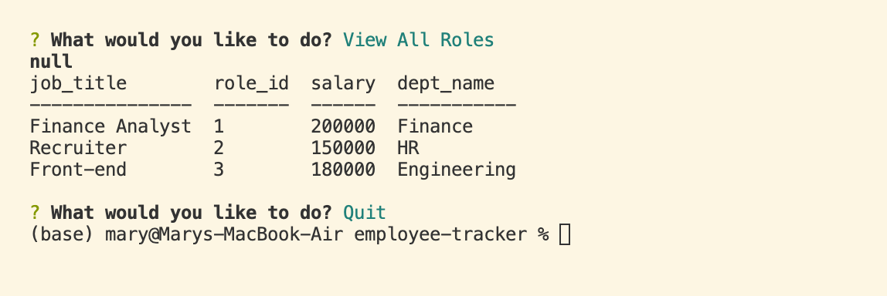

# Employee Tracker

    
## Description

Employee tracker allows a user to request information on a department, role, and employee. It provides them with a prompt of choices for what they would like to view. They can see all employees, all roles, and all departments as well as update change/add data to the database of information connected. It's a simple interface for users to interact with the employee database.

#### Example Output

[]

## Table of Contents

* [Installation](#installation)
* [Usage](#usage)
* [Credits](#credits)
* [License](#license)
* [Contributing](#contributing)
* [Tests](#tests)
* [Questions](#questions)

## Installation

It requires express.js, mysql2, inquirer, and console.table installed. 

## Usage

To use employee tracker, run node index.js. You will then be presented with a series of choices to choose from after a prompt. When the user selects a choice they will be presented with a table of the information from that choice. This data is created by quering the tables in the employee_db database. The choices can be updated with options and corresponding queries to make the application include table outputs for other views.

## License

This is covered under the MIT license. 

## Questions

### Github Username
mardill: [https://github.com/mardill](https://github.com/mardill)

### Email
mary.dillon09@gmail.com

     
